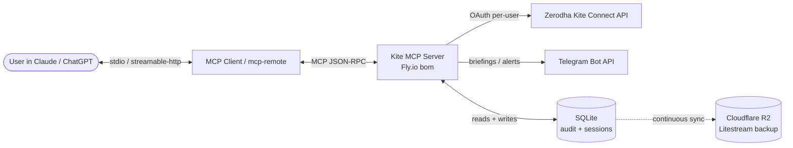
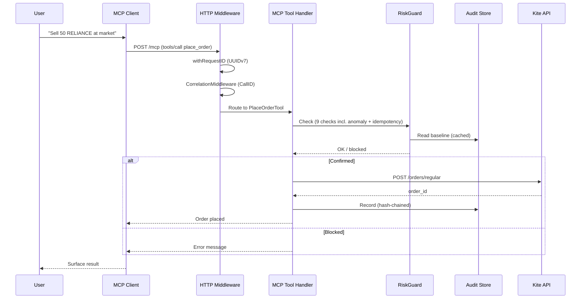
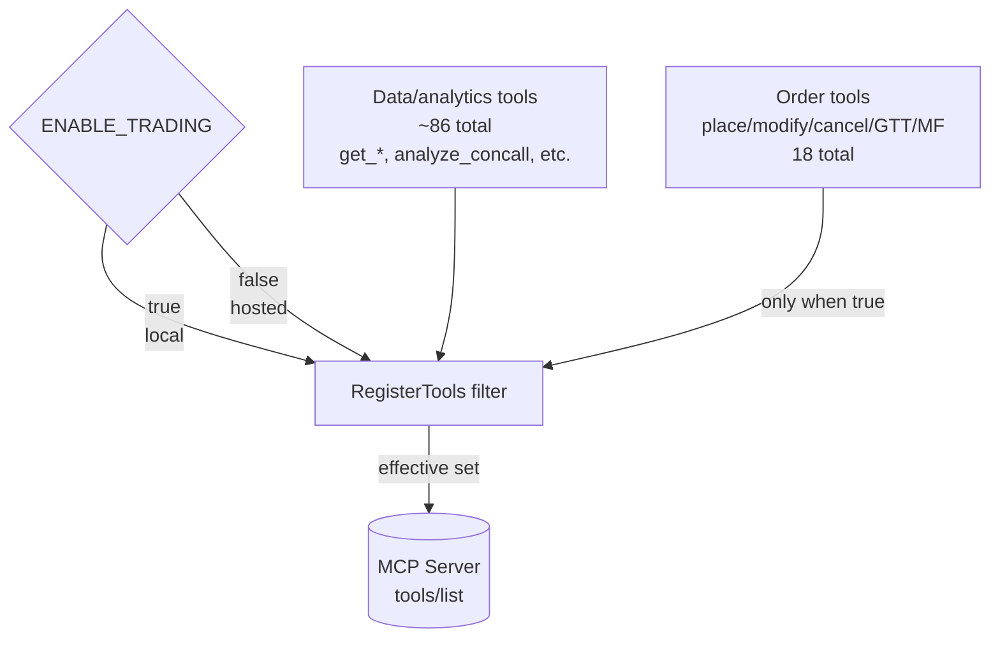
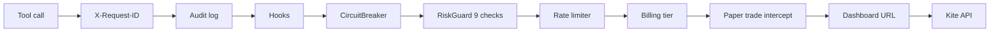
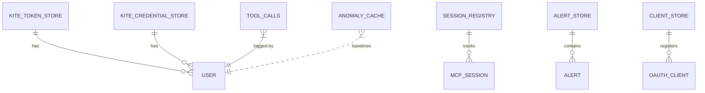

# Architecture Diagrams

Visual complement to [ARCHITECTURE.md](../ARCHITECTURE.md). Text-first for grep-ability; Mermaid for GitHub preview.

## High-level flow



## Request lifecycle (tool call)



## Path 2 gate diagram



## Security layers



## Data stores (AES-256-GCM encrypted via HKDF from OAUTH_JWT_SECRET)



## Deployment topology (Fly.io)

```
┌──────────────────────────────────────────────────────┐
│ Fly.io bom region                                    │
│ ┌──────────────────────────────────────────────┐     │
│ │ kite-mcp-server machine (512 MB RAM)         │     │
│ │  ┌────────────┐    ┌─────────────┐           │     │
│ │  │ MCP server │ ←→ │ SQLite      │           │     │
│ │  │ (Go)       │    │ (data/)     │           │     │
│ │  └────────────┘    └──────┬──────┘           │     │
│ │                           │ Litestream       │     │
│ └──────────────────────────────┬───────────────┘     │
│                                │                     │
│  static egress IP              │                     │
│  209.71.68.157                 │                     │
└────────────────────────────────┼─────────────────────┘
                                 │
                                 ↓
                    ┌──────────────────────┐
                    │ Cloudflare R2        │
                    │ kite-mcp-backup      │
                    │ APAC                 │
                    └──────────────────────┘
                                 │
                                 ↓
     ┌──────────────────────────────────┐
     │ Zerodha Kite Connect API         │
     │ api.kite.trade                   │
     │ (IP 209.71.68.157 whitelisted)   │
     └──────────────────────────────────┘
```

## Related docs
- [ARCHITECTURE.md](../ARCHITECTURE.md) — high-level text
- [SECURITY.md](../SECURITY.md) — security posture
- [docs/monitoring.md](./monitoring.md) — observability
- [docs/incident-response.md](./incident-response.md) — when things go wrong
